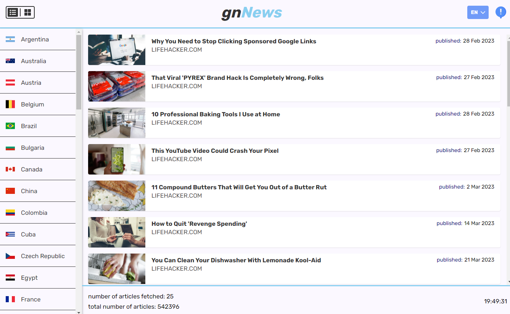

Przed wystartowaniem aplikacji lokalnie należy:
- utworzyć plik zmiennych środowiskowych (.env) i umieścić swój własny klucz api - VITE_API_KEY=..., który generuje się po zarejestrowaniu konta w serwisie https://newsapi.org/

Do stworzenia aplikacji wykorzystałem:
- typescript,
- react.js,
- redux toolkit, rtk query,
- react router,
- styled components,
- vitest + rtl (testy)
- i18next (translacja),
- customowy config eslinta

